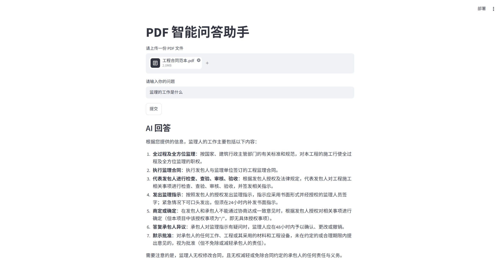

# 🚀 AI-Learning-Journey (人工智能学习之旅)

## 📌 项目概览
本项目记录了我从零基础学习 Python，到独立跑通 **基于 RAG 架构的工程合同智能问答系统** 的完整历程。

## 🔥 核心项目：RAG工程合同智能问答系统

### 💡 项目背景
针对工程合同篇幅长、传统关键词检索效率低、大模型易产生“幻觉”等问题，独立开发了这款 AI 问答应用。

### 🛠️ 技术架构
- **后端**：Python, LangChain
- **模型**：DeepSeek API (LLM) + HuggingFace (本地 Embedding)
- **数据层**：PyPDFLoader (文本解析), ChromaDB (向量数据库)
- **前端**：Streamlit (网页交互界面)

### ✨ 核心功能
1. 支持用户上传真实的 PDF 工程合同。
2. 自动进行文本切分与向量化存储。
3. 基于用户提问，语义检索最相关的 3 个文本块，结合 LLM 生成准确回答。
4. 具备异常捕获与日志记录机制，系统稳定可靠。
